## HOSTING A STATIC WEBSITE ON AWS S3 Bucket (PRIVATE BUCKET) WITH PUBLIC POLICY ASSIGNED USING CLOUDFRONT

### Introduction
---
Amazon Web Services (AWS) is a leading cloud computing platform provided by Amazon.com. It offers a wide range of services that cater to businesses and individuals, allowing them to build and deploy various applications and services quickly and securely without the need to invest in physical infrastructure.

**Table of contents**
1. [What is Amazon S3 bucket](#what-is-amazon-s3-bucket) 
1. [Why is S3 useful](#why-is-s3-useful)
1. [Core concepts](#core-concepts)
1. [S3 storage classes](#s3-storage-classes)
1. [S3 Security](#s3-security)
1. [Static Website](#static-website)
1. [Amazon CloudFront](#amazon-cloudfront)
1. [prerequisite](#prerequisite) 
1. [Step-by-step walkthrough](#step-by-step-walkthrough) 
1. [Conclusion](#conclusion)

## What is Amazon S3 bucket
**S3** stands for `Simple Storage Solution`, launched in 2006 as AWS first service focused on general object storage on the cloud, its Object storage comprises big files, small files, media content, source code, and spreadsheets in a folder structure i.e. no constraints on the kind of content to be stored.

It's cost-effective ($0.023 per GB) for storage, its cost decreases the more you store in S3, and likewise its built-in redundancy with 99.99% durability (no data lost), scalable, highly available, and supports integration with AWS.

It’s useful in different varieties of contexts:
- Website (HTML, CSS, JAVASCRIPT, BOOTSTRAP)
- Database backups
- Build data processing pipelines

## Why is S3 useful
- Cheap, reliable way to store objects
- Low latency, high throughput access
- Can integrate with SNS, SQS, and Lambda for powerful event-driven applications
- Has mechanisms to shift away old data into long-term storage for cost reduction

## Core concepts
- **Buckets**: are container(s) of objects to be stored, a bucket name has to be created, and globally unique
- **Objects**: contents that are stored inside the bucket e.g. files/contents, maximum size 5TB. It could be accessed via URL e.g. `url:http://s3.amazons.com/<BUCKETNAME>/<OBJECTNAME>`, It has to be publicly exposed to access the URL.

## S3 storage classes
Storage classes allow you to reduce cost but with certain sacrifices, examples of storage classes include `standard, intelligent, infrequent access, Glacier`, each tier has different pricing, latency, and availability.

For example, standard tier (HOT DATA) => infrequent Access => Glacier (Cold data) mining data into different storage classes depending on the duration using life cycle rules. Life cycle rules automate the data movement process.

## S3 Security
s3 security is critical to protect your data, considering the following security measures:
- **IAM Policies**: to control access to S3 resources
- **Bucket Policies**: to control access to the bucket
- **Access Control Lists (ACLs)**: to control access to individual objects
- **Encryption**: to protect data at rest and in transit
- **Cross-Origin Resource Sharing (CORS)**: to control access to resources from different origins
- **Public access**: which is blocked by default
- **Data protection**: is highly durable and availability guarantees encryption in transit at rest.
- **Monitoring**: S3 provides metrics and logs to monitor access to your data
- **Auditing**: supports access logs, action-based logs, alarms
- **Infrastructure security**: leveraging on-top of AWS cloud infrastructure.

**NOTE**:

**S3** Bucket is more than a storage, it could be used as display in the image below:

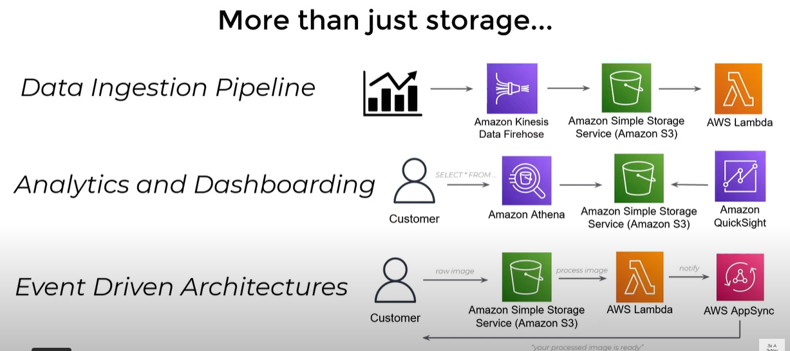

Pricing of S3 Bucket could be explained in the image as illustrated below:

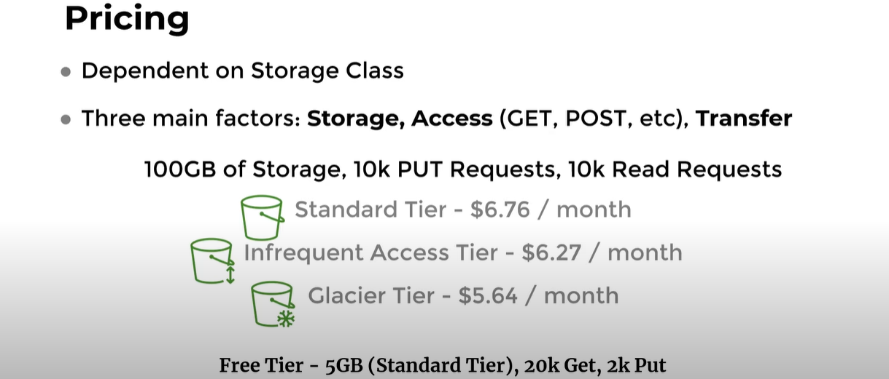

## Static Website

As the name implies, a static website has no dynamic component, a static website is any regular website that is usually made up of plain HTML files, CSS stylesheets, images, videos as well and JavaScript files. A static website have no capabilities to perform any dynamic request or backend processing, such as processing data or retrieving data from a database.

## Amazon CloudFront 
Amazon CloudFront is a global Content Delivery Network (CDN) service that caches and serves files & data to anyone globally for easy access quickly with low latency.

## Prerequisite

1. AWS account fully setup
1. The files for your static website.

## Step-by-step walkthrough
1. [Creating a Bucket on Amazon S3](#step-1-creating-a-bucket-on-amazon-s3)
1. [Upload Website files to S3 Bucket](#step-2-upload-website-files-to-s3-bucket)
1. [Creating a CloudFront Distribution](#step-3-creating-a-cloudfront-distribution)
1. [Adding Bucket Policy](#step-4-adding-bucket-policy-and-s3-bucket-permission)
1. [Outcome](#step-5-outcome)
1. [Conclusion](#conclusion)

### Step 1: Creating a Bucket on Amazon S3
a) Login into AWS console with your **account** 

b)After logging into your AWS Console, under **Services** > **All Services**, search for “S3” and click on it to go to the S3 dashboard and create a bucket.

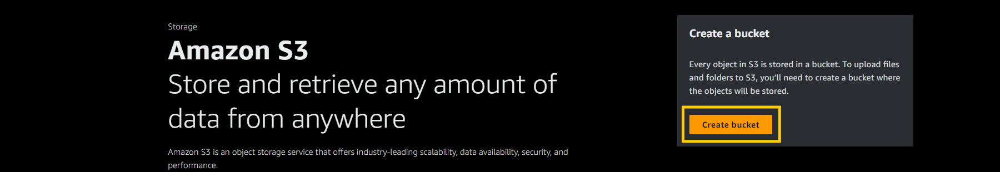

c) Enter a bucket name. The name has to be globally unique, try with another name if you get an error “Bucket with the same name already exists” and click on **create**, leave all settings as default.

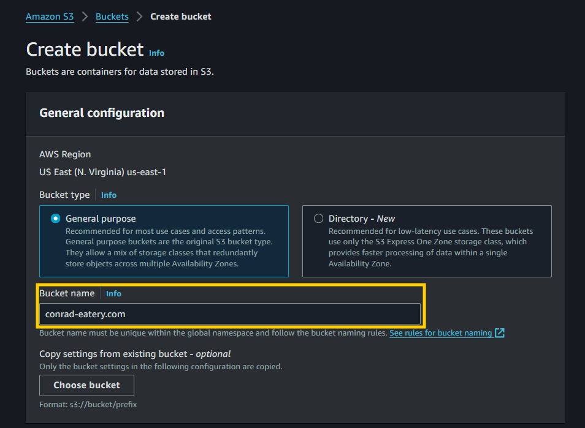

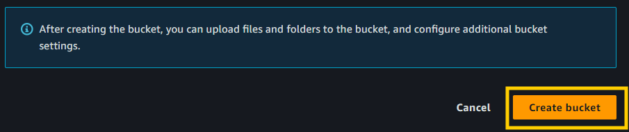

### Step 2: Upload Website files to S3 Bucket

a) After creating a new bucket, click on the bucket name to view the bucket details.

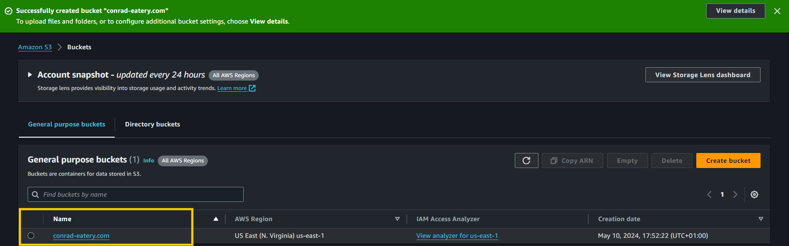

b) When you create a new bucket it will be always empty. Click on the Upload button to upload some files.

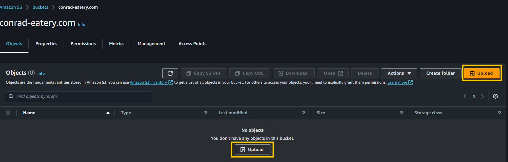

c) On the File Upload page, click on the Add files to add a file from your computer, or Add folder to add multiple files from a folder. here the static website folder was selected **cripsy_kitchen**. 

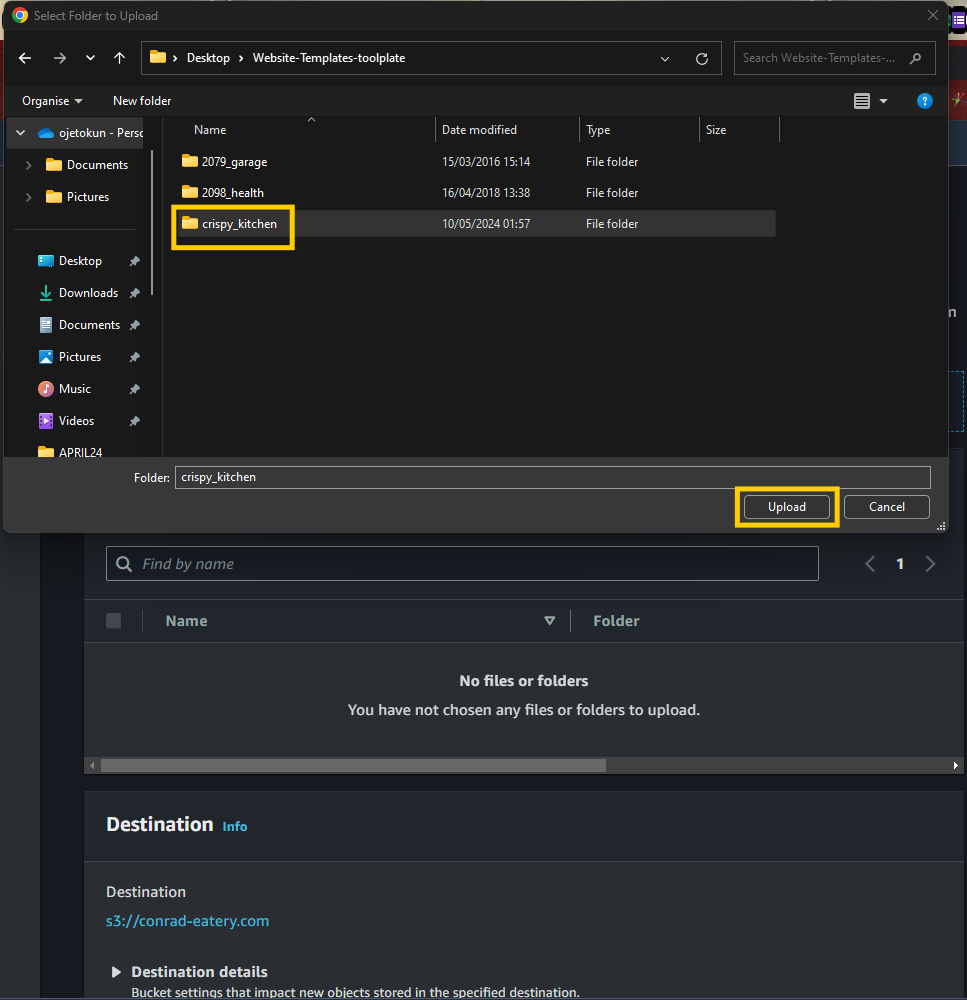

From the screenshot above, I’ve already added some HTML files, and Make sure you have added all the necessary files for your static website.

d) Leave all other settings intact, scroll to the bottom of the page and click on the Upload button to start the uploading of the files you have added above.

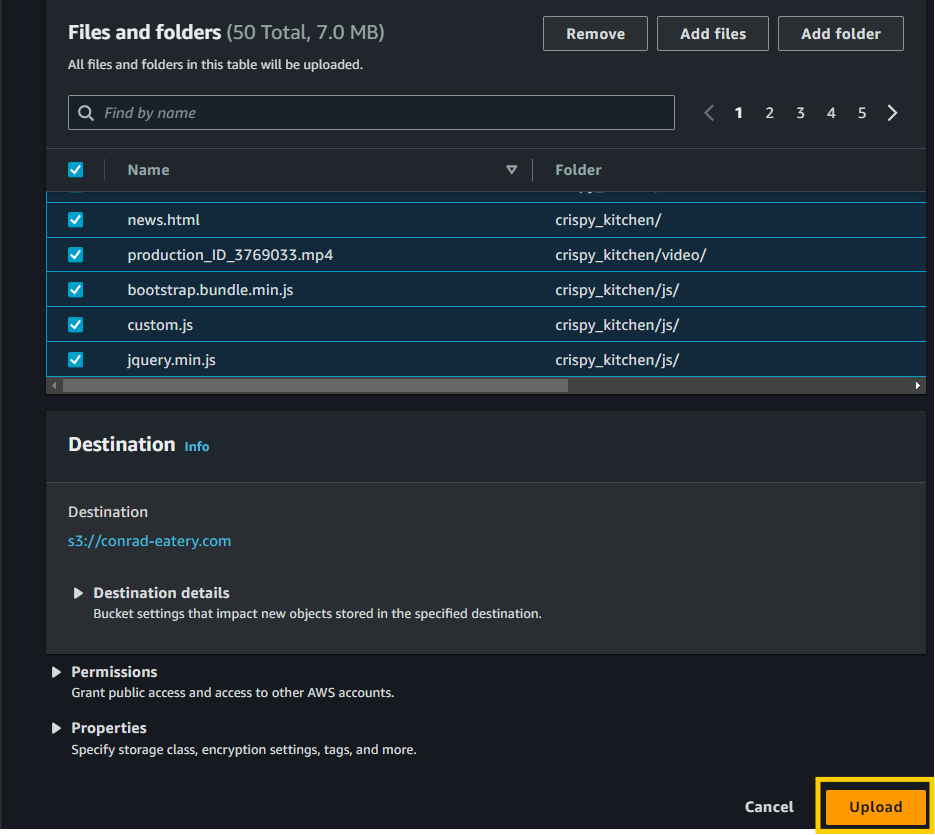

**NOTE**: Due to network connection and the bulk of files, you will have to wait while the files are being uploaded to the S3 Bucket.

e) Once the uploading process has been completed, check for the validility of the file to be sure it has been uploaded successfully else if there are any errors just click on the Close button to return to the Bucket details screen.
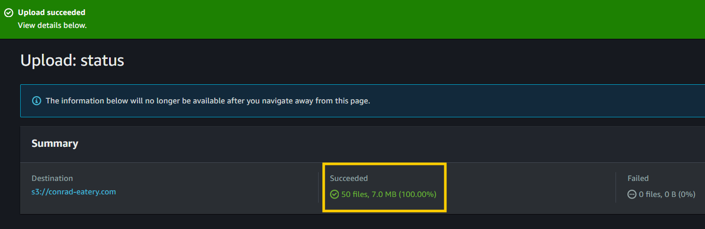
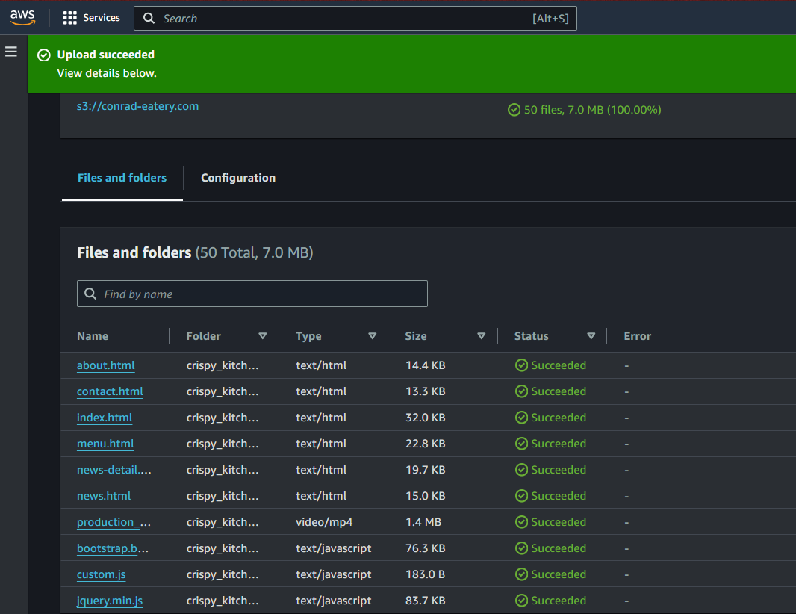

## Step 3: Creating a CloudFront Distribution

a) From the top navigation under **Services** > **All Services**, search for “CloudFront” and click on it.

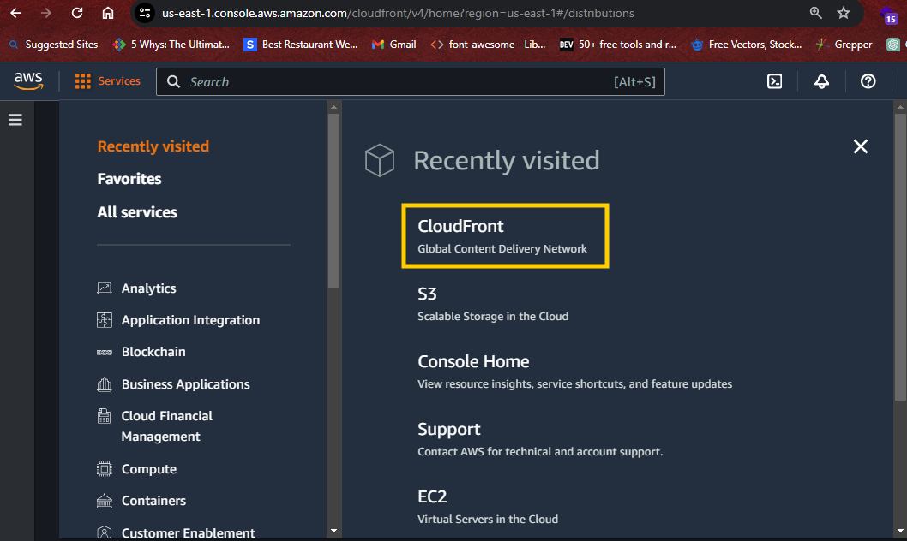

b) On the CloudFront Distributions page, click on the Create distribution button. 

On the Create distribution page > fill the following information as seen in the image below:
- under Origin section > for Origin domain > enter the Amazon S3 static website endpoint.
- select Origin Name
- select Origin access Control settingss (recommended)
- click Create new OAC

under new OAC section
- select endpoint domain for S3 bucket
- select sign requests (recommended)
- then click Create new OAC

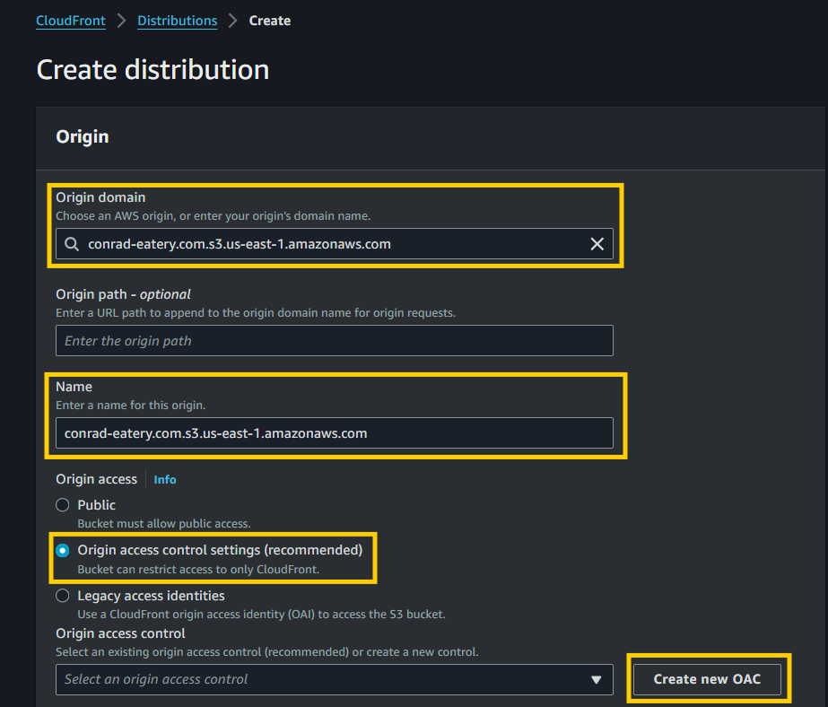

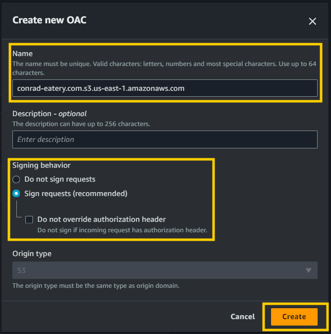

**Follow the information as given in the screenshot below:**

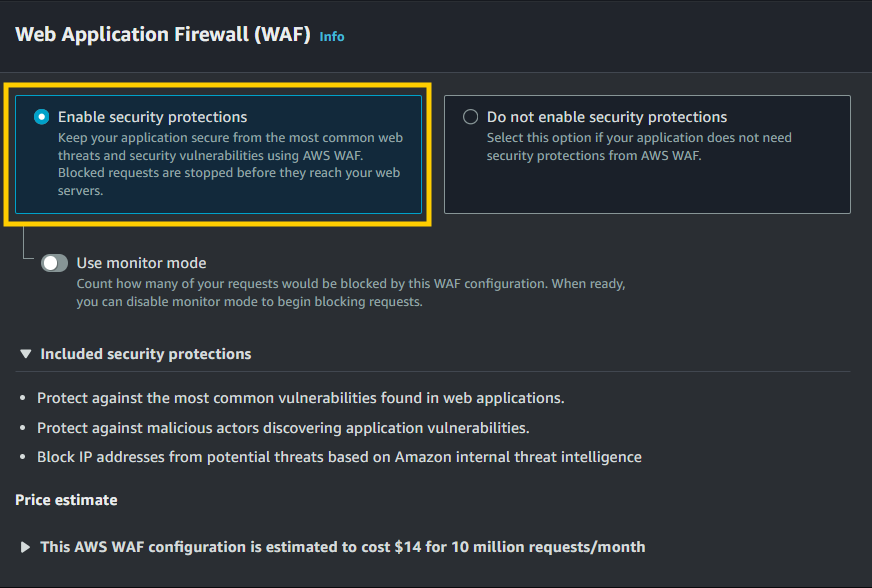

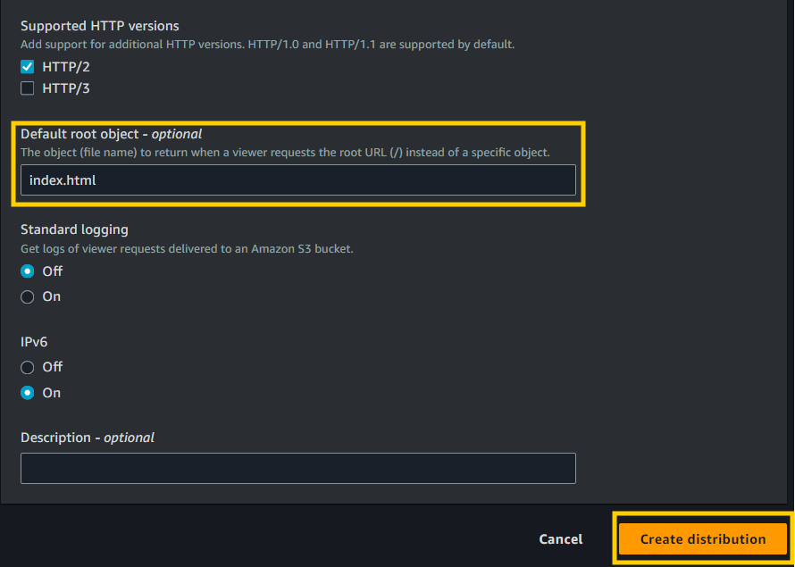

## Step 4: Adding Bucket Policy and S3 Bucket Permission

a) Copy the bucket policy and to s3 bucket permission and paste it in the bucket policy.

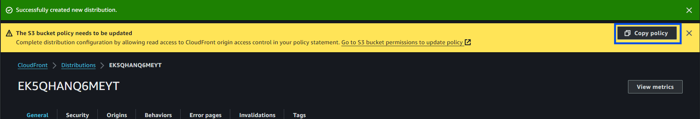

b) Click on the S3 bucket name > Permissions > Bucket Policy > paste the copied bucket policy > Save.

**The description is seen as below:**

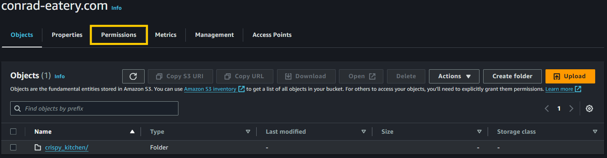

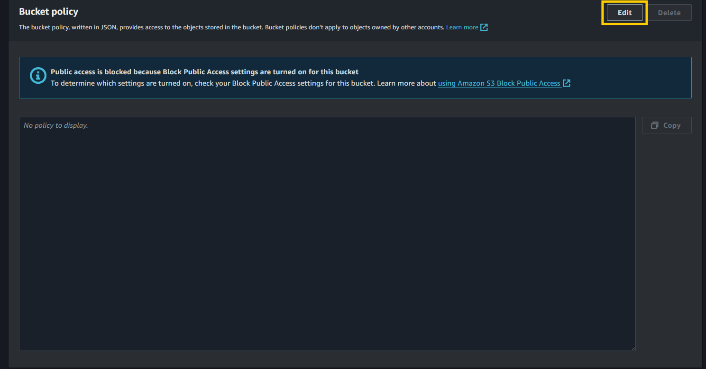

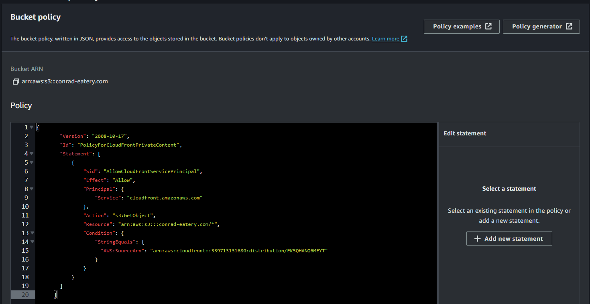

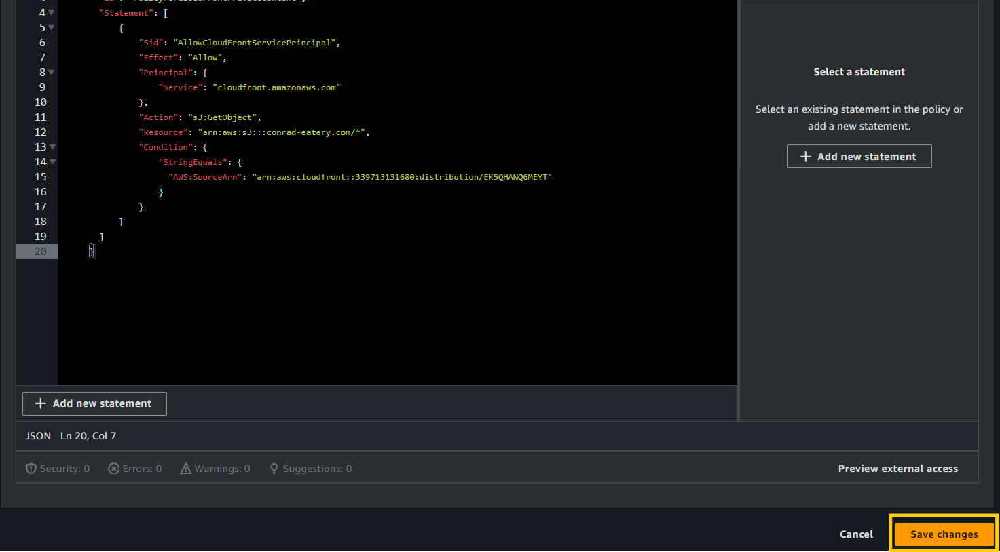

c) Copy out the Distribution domain name from cloudfront and paste it in the bucket policy.

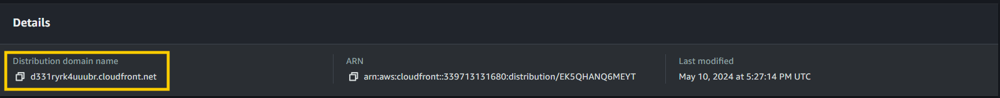

## Step 5: Outcome
copy the cloudfront url and paste it in the browser to load the static website

### Conclusion
You have successfully setup, deployed/hosted a highly accessible static website on AWS using Amazon S3 and Amazon CloudFront. This is accomplished without setting up a single server instance.
